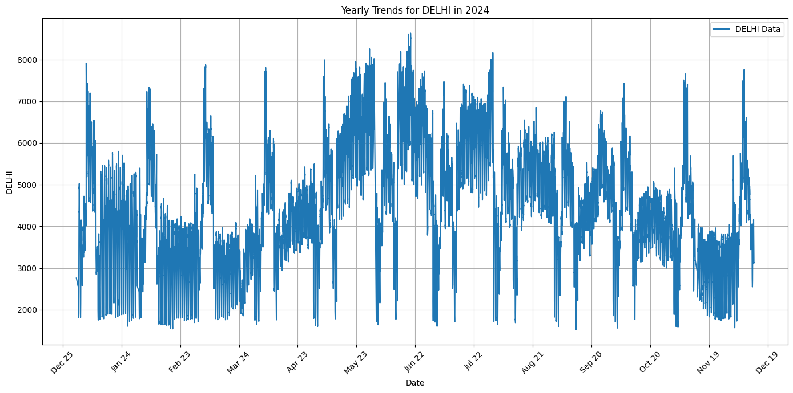
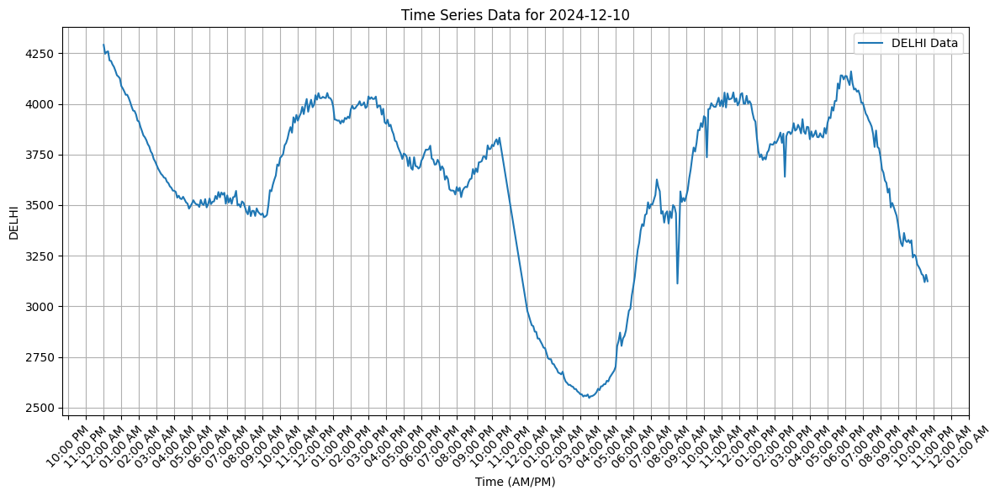
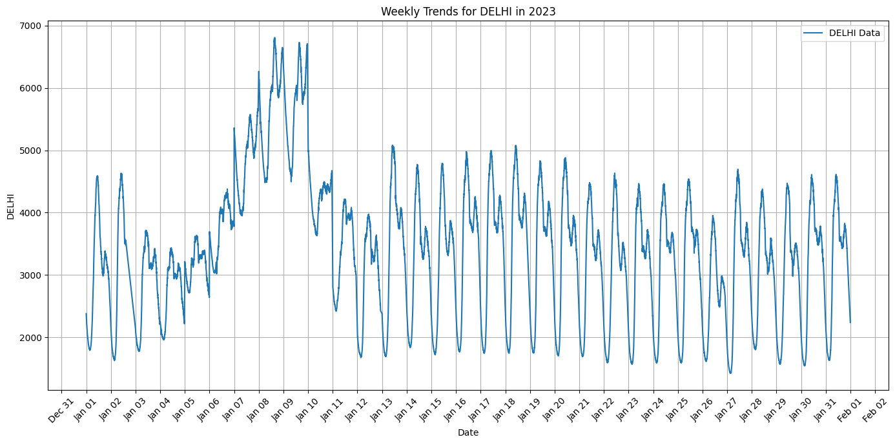
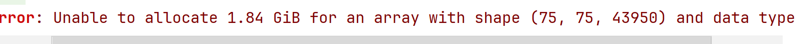

# Vidyutt-backend

## hello this is the entirity of adhoc code used used to collect scrape and train models for my SIH project.

### let me give you an overview of what is actually going on
- data is sourced from [State load Dispatch Center](https://www.delhisldc.org/Redirect.aspx?Loc=0804) and [Grid India reports](https://report.grid-india.in/index.php?p=Daily+Report%2FPSP+Report) 
- the grid report data was in the form of pdfs and was converted to xlsx and then those xlsx files were merged and turned into a consistant dataset.
- as the data was complete and was definitely accurate so we shifted our focus on testing and trying diffrent models, cross refrencing and validating our results.
- here are our findings:
    - the arima plus model provided by vertex ai for on demand custom training was the most inaccurate one and yielded around 89% accuracy
    - Seasonal Autoregressive Moving Average(SARIMA) model was one of the best choices we could pursue and here are the specific values we used:
        - the model was stationary and had a p-value 0(could be a methodological error)
        - the ADF statistic was : -23.047657363554325
        - the p , q and r values were taken to be 1,1 and 1 respectively
        - P , Q , R and m values were taken to be 0, 1 ,5 and 12 respectively

------------------

# Data Characterstics:
## Visualising Yearly Trends
- It is pretty apparent that the data is seasonal in nature as we encounter steep peaks in the months of May and they slowly taper off till December.
- other than being seasonal it has nonsensical spikes and dips that need to be explained on a monthly, weekly and daily level for it to be coheasive in predicting the demand for a 5 minute interval on a specific day.  

## Weekly and Daily Observations 
- there are periodic peaks and downturns experienced probably influenced by weekends.
- The data fluctuates significantly over 24 hours, indicating dynamic behavior during the day.
- Peaks are observed in the late evening and during working hours (morning to early evening).
- There is a sharp drop in the metric during the night (early morning hours, between 2:00 AM to 6:00 AM).
- There is a gradual rise post-6:00 AM, reaching a stable level during the daytime and declining again post-evening.

 

## Visualising Yearly Trends in data

## Shortcomings
#### The amount of time spent on performing Data Science on the data should have been much shorter and we should have had been focused more on training the ML model before doing some basic sanity checks on data and what's the best approach to handle it should be considering the time constraints it wasan't the best approach.
#### We had major issues with setting up ROCOM on WSL and in hindsight we should have had just installed a GNU/Linux distro to train on instead of having so much trust on everything working as expected on windows. 
#### We should have been more lax with dropping columns which had inconsistancies with the rest of the set for the data sourced from grid-india as it would have had negligible performance effect but would have reduced the training time a bit but would have saved us a ton of time during processing.
#### Should have had trained multiple models simultaneously as one of our models failed after 6 hours and 5 minutes of training creating a panic

## Conclusion 
#### overall we would like to thank the goverment of India for such a great learning opportunity.
-----------
## See You Next Year : )

-----------
